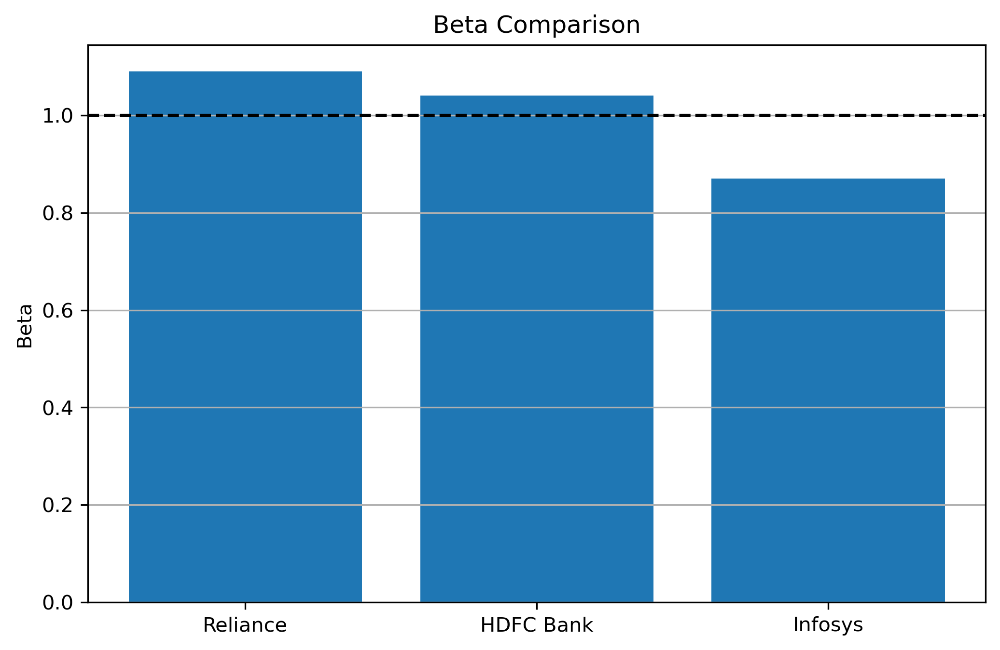

# CAPM Beta Estimation Using Custom Gradient Descent

## Overview

This project estimates stock beta using the Capital Asset Pricing Model (CAPM) framework and a custom gradient descent implementation. It is a return-based regression analysis, not a stock price prediction project.

The workflow estimates each stock's beta using the Security Characteristic Line (SCL):

$$
R_i = \alpha_i + \beta_i R_m + \epsilon_i
$$

It then applies the CAPM equation to estimate theoretical expected annual returns:

$$
E(R_i) = R_f + \beta_i \left(E(R_m) - R_f\right)
$$

## Objective

The objective is to build a clean, interpretable finance and machine learning project that:

- Downloads daily historical market data from `yfinance`.
- Converts adjusted close prices into daily returns.
- Estimates beta using custom linear regression and gradient descent.
- Evaluates model fit using regression metrics.
- Applies CAPM to estimate expected annual returns.
- Saves reusable plots and result CSV files.

## Financial Background

CAPM connects expected return to systematic market risk. The key input is beta ($\beta$), which measures how sensitive a stock's returns are to market returns.

- Beta greater than 1 means the stock has historically moved more than the market.
- Beta near 1 means the stock has historically moved broadly with the market.
- Beta less than 1 means the stock has historically moved less than the market.

Alpha ($\alpha$) is the regression intercept. In this project, it represents the average daily return component not explained by NIFTY50 returns in the fitted SCL regression.

$R^2$ measures how much of the variation in a stock's daily returns is explained by variation in NIFTY50 daily returns.

## Security Characteristic Line

The Security Characteristic Line is the empirical regression used to estimate beta:

$$
R_i = \alpha_i + \beta_i R_m + \epsilon_i
$$

In this project:

- $R_i$ is the stock daily return.
- $R_m$ is the NIFTY50 daily return.
- $\beta_i$ is the slope of the regression line.
- $\alpha_i$ is the intercept.

The regression estimates beta from historical data. CAPM then uses the estimated beta to calculate theoretical expected return.

## Dataset and Source

Data is collected with `yfinance`.

| Asset | Ticker |
|---|---|
| Reliance Industries | `RELIANCE.NS` |
| HDFC Bank | `HDFCBANK.NS` |
| Infosys | `INFY.NS` |
| NIFTY50 | `^NSEI` |

The analysis uses daily adjusted close prices from `2023-05-20` to `2026-05-20`. NIFTY50 is used as the market proxy because it is a broad benchmark for large-cap Indian equities.

## Methodology

1. Download daily adjusted close prices.
2. Clean and align all asset price series by date.
3. Convert adjusted close prices into daily log returns (using np.log(P_t / P_t-1)).
4. Use NIFTY50 returns as the market return series.
5. Train one custom linear regression model per stock.
6. Estimate alpha and beta using gradient descent.
7. Verify gradient descent results against closed-form OLS (beta = Cov(X,Y)/Var(X)) as a sanity check.
8. Calculate $R^2$, MAE, RMSE, final gradient descent cost, and CAPM expected return.
9. Save results and visualizations under `outputs/`.

Returns are used instead of prices because CAPM is a return-based model. Returns put all assets on a comparable percentage-change scale and directly match the interpretation of beta as market-return sensitivity.

## Gradient Descent

The primary regression model is implemented manually. The cost function is half mean squared error:

$$
J(\beta, \alpha) =
\frac{1}{2m}
\sum_{j=1}^{m}
\left(\hat{R}_{i,j} - R_{i,j}\right)^2
$$

The notebook includes custom functions for:

- Cost calculation
- Gradient calculation
- Gradient descent parameter updates
- Regression metric calculation

`sklearn` is not used for the primary regression.

## Sanity Checks

The notebook was adjusted to use a more current three-year daily window, which is closer to common published beta lookback periods than the earlier fixed 2023-2025 sample.

Published beta values still do not match exactly across websites because providers use different lookback windows, return frequencies, market benchmarks, and sometimes ADR listings instead of NSE listings. As a rough check:

- [Trading Economics](https://tradingeconomics.com/india/government-bond-yield) showed India 10Y government bond yield at 7.12% on May 20, 2026, so the notebook uses 7.12% as the risk-free rate.
- GuruFocus reported Reliance beta around [1.0378](https://www.gurufocus.com/term/beta/NSE%3ARELIANCE) and HDFC Bank beta around [0.8800](https://www.gurufocus.com/term/beta/NSE%3AHDFCBANK) in April 2026.
- TopStockResearch reported NIFTY50-based long-term beta values of [0.912 for Reliance](https://www.topstockresearch.com/rt/Stock/RELIANCE/BetaAndVolatility), [1.03 for HDFC Bank](https://www.topstockresearch.com/rt/Stock/HDFCBANK/BetaAndVolatility), and [1.25 for Infosys](https://www.topstockresearch.com/rt/Stock/INFY/BetaAndVolatility), calculated on monthly ticks over four years.

These sources confirm that the notebook results are in a reasonable range, but exact equality should not be expected.

## Results Summary

CAPM assumptions used in the notebook:

- Risk-free rate: 7.12% annually
- Expected market return: 12% annually

| Stock | Ticker | Alpha | Beta | $R^2$ | MAE | RMSE | Final GD Cost | CAPM Expected Annual Return |
|---|---|---:|---:|---:|---:|---:|---:|---:|
| Reliance | `RELIANCE.NS` | -0.000066 | 1.090662 | 0.461764 | 0.006937 | 0.009673 | 0.000047 | 12.44% |
| HDFC Bank | `HDFCBANK.NS` | -0.000387 | 1.040556 | 0.479111 | 0.006425 | 0.008913 | 0.000040 | 12.20% |
| Infosys | `INFY.NS` | -0.000200 | 0.870702 | 0.210132 | 0.009910 | 0.013867 | 0.000096 | 11.37% |

## Key Insights

- Reliance has the highest estimated beta in this sample, making it the most market-sensitive of the three stocks analyzed.
- HDFC Bank has a beta close to 1, suggesting market-like sensitivity over the sample period.
- Infosys has the lowest beta in this run, meaning it was less sensitive to NIFTY50 movements than Reliance and HDFC Bank.
- $R^2$ is highest for HDFC Bank, meaning NIFTY50 returns explain a larger share of HDFC Bank daily return variation than they do for Infosys in this sample.
- CAPM expected return rises with beta when the expected market return is greater than the risk-free rate.


## Implementation Notes

[#implementation-notes](#implementation-notes)

This project uses custom gradient descent for the regression, which I implemented manually in NumPy. I used AI assistance to improve code structure, documentation formatting, and visualization code. The core CAPM methodology, gradient descent logic, and analysis framework are my own.

## Important Plots




Additional plots are saved in `outputs/plots/`, including regression plots, actual vs predicted return plots, residual plots, cost history plots, and return distributions for each stock.

## How to Run

Create an environment and install dependencies:

```bash
python -m venv venv
source venv/bin/activate
pip install -r requirements.txt
```

Open the notebook:

```bash
jupyter notebook CAPM_Beta_Estimation.ipynb
```

To execute from the command line:

```bash
jupyter nbconvert --to notebook --execute CAPM_Beta_Estimation.ipynb --inplace
```

## Folder Structure

```text
.
|-- CAPM_Beta_Estimation.ipynb
|-- README.md
|-- requirements.txt
|-- outputs/
|   |-- plots/
|   |   |-- beta_comparison.png
|   |   |-- capm_expected_returns.png
|   |   |-- reliance_regression.png
|   |   `-- ...
|   `-- results/
|       |-- adjusted_close_prices.csv
|       |-- daily_returns.csv
|       |-- regression_results.csv
|       `-- capm_expected_returns.csv
`-- .gitignore
```
